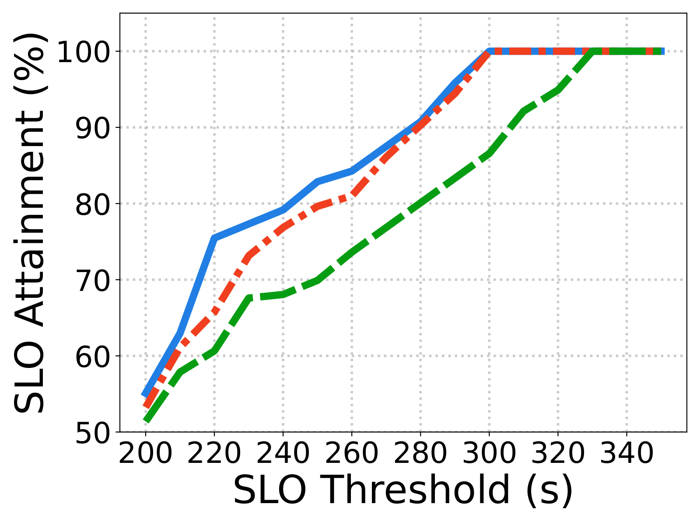
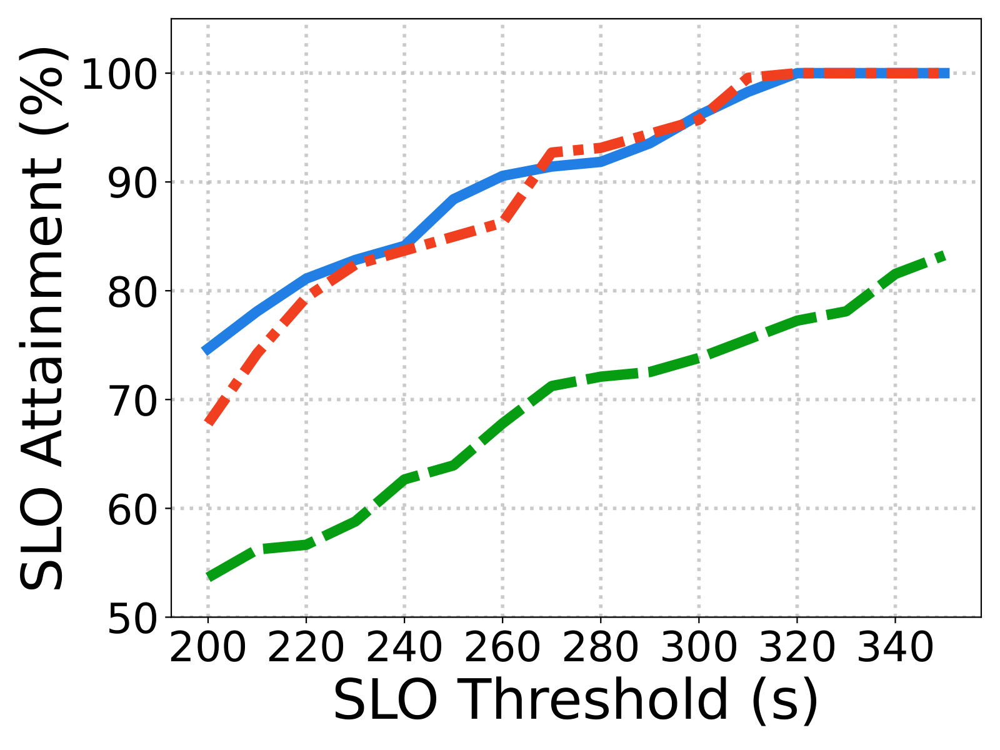
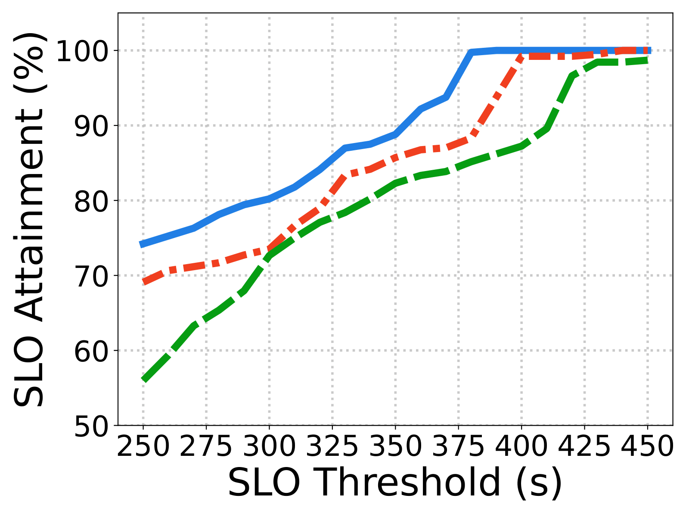
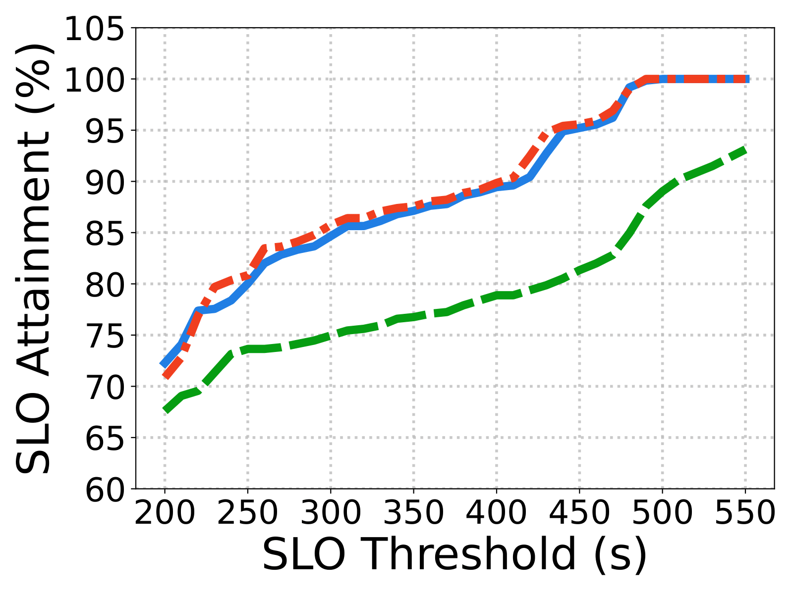

<div align="center">

<h1>WWW&#46;Serve: a Decentralized Framework for Collaborative LLM Serving</h1>

Huanyu Wang<sup>1</sup>, Ziyu Xia<sup>2</sup>, Zhuoming Chen<sup>2</sup>, Beidi Chen<sup>2</sup>

<sup>1</sup>Shanghai Jiao Tong University, <sup>2</sup>Carnegie Mellon University

-----------------
</div>

<div align="center">
[<a href="TODO">Paper</a>] | [<a href="TODO">Blog</a>]
</div>


## TL;DR

We introduce **WWW&#46;Serve**, a *decentralized framework for trustless yet collaborative multi-LLM serving*. It preserves service providers’ anonymity and privacy, while supporting self-organizing request dispatch, dynamic workload balancing, and autonomous resource/policy control.  

Three key designs are integrated:
- a blockchain-inspired credit system for trustless collaboration.
- gossip-driven peer synchronization for flexible participation.
- a duel-and-judge mechanism for robust contributor evaluation.

Under various configurations, WWW&#46;Serve improves global SLO attainment by up to <strong>1.5x</strong> and lowers latency by <strong>27.6%</strong>. Its performance approaches, and in some cases surpasses, centralized scheduling, while preserving the benefits of decentralization.

<div align="center">
  
</div>

<table align="center" style="border-collapse: collapse; table-layout: fixed; width: 100%;">
  <tr>
    <td align="center" width="25%"></td>
    <td align="center" width="25%"></td>
    <td align="center" width="25%"></td>
    <td align="center" width="25%"></td>
  </tr>
</table>


## Repository Structure

The repository is organized as follows:

```
WWWServe/
├── experiments/
|   ├── simulation/
|   |   └── simu_xxx.py
|   └── visualization/
|       └── visualize_xxx.ipynb
├── node_configs/
|   └── nodes.yaml
├── www_serve/
|   ├── policies/
|   |   └── default_policy.py
|   └── core_codes.py
├── README.md
└── requirements.txt
```

- `experiments/`: simulation scripts for network experiments and notebooks for visualization.
- `node_configs/`: YAML configuration files specifying parameters for each node.
- `www_serve/`: core implementation of WWW&#46;Serve, including policies and scheduling logic.


### Installation
```
conda create -n wwwserve python=3.12
conda activate wwwserve
pip install -r requirements.txt
```

**Note**: The above installs only the core dependencies for scheduling. To deploy actual LLM servers, you will need to manually install additional backends (e.g., SGLang, vLLM) depending on your experimental setup.


### Usage

The typical workflow of WWW&#46;Serve consists of the following steps:


#### 1. Launch LLM Servers

Start your preferred LLM backend (OpenAI-Compatible Server) and obtain its base URL and API key. For example:

```bash
# SGLang
# Note: use "--enable-metrics" to expose server status for scheduling
python3 -m sglang.launch_server --model-path $MODEL_PATH --host 0.0.0.0 --port $PORT --enable-metrics

# vLLM
vllm serve $MODEL_PATH  --max-model-len=16384 --host 0.0.0.0 --port $PORT
```


#### 2. Configure Nodes

Each node is specified via a YAML configuration file placed in `node_configs/`:

```yaml
server_params:
  ip: 127.0.0.1                  # node communication address
  port: 5778
  policy: default_sglang         # scheduling / dispatching policy
  offload_frequency: 0.8
  queue_frequency: 0.2
  accept_frequency: 0.8

ledger_params:
  initial_credit: 1000.0
  initial_staked: 0.0

models:
  - model_path: Qwen/Qwen3-8B
    base_url: <BASE_URL>:<PORT>  # from launched LLM server (Step 1)
    api_key: None

    gen_params:
      max_tokens: 8192
      temperature: 0.0
      top_p: 0.95

    dispatch_params:
      target_token_usage: 0.6
```


#### 3. Run Simulation

Use the scripts in `experiments/simulation/` to start a network simulation. For example:

```bash
cd experiments/simulation
python simu_decentralized.py

# python simu_centralized.py
# python simu_single.py
```

By default, the simulation outputs are saved in `experiments/results/`, including:
- nodex.json: runtime status log of each node.
- result.json: aggregated results for all requests.


#### 4. Visualization

The simulation results can be analyzed using the Jupyter notebooks in `experiments/visualization/`. These notebooks allow you to visualize: Global SLO attainment, request latency distribution, and server load status.


### TODOs
- TODO


### Citation
```
TODO
```